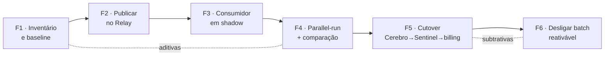

# Cadeia de migração de arquitetura — batch → event-driven

> Biblioteca de prompts operacionais da Aegis · Checkpoint 05
> Cadeia de 3 elos para planejar migrações incrementais e reversíveis de pipelines de dados.
> Criada via meta-prompting. O que se versiona é o prompt parametrizável final, não o meta-prompt.

---

## Índice

- [O que esta cadeia faz](#o-que-esta-cadeia-faz)
- [Como usar](#como-usar)
- [Parâmetros](#parâmetros)
- [Contrato de handoff](#contrato-de-handoff)
- [Elo 1 — Diagnóstico](#elo-1--diagnóstico)
- [Elo 2 — Decomposição em fases](#elo-2--decomposição-em-fases)
- [Elo 3 — Runbook executável de uma fase](#elo-3--runbook-executável-de-uma-fase)
- [Execução no cenário do Forge](#execução-no-cenário-do-forge)
- [Testes estruturais (rodam em pipeline)](#testes-estruturais-rodam-em-pipeline)
- [Curadoria e notas de operação](#curadoria-e-notas-de-operação)
- [Changelog](#changelog)

---

## O que esta cadeia faz

Quebra uma migração de arquitetura grande demais para um prompt só em três atos que dependem um do outro:

1. **Diagnóstico** — fotografa o estado atual, mapeia acoplamentos e fixa as invariantes que não podem quebrar. Não propõe nada.
2. **Decomposição em fases** — recebe o diagnóstico e quebra a migração em passos incrementais e reversíveis (strangler-fig / parallel-run).
3. **Runbook de uma fase** — recebe o plano faseado e detalha *uma* fase como runbook executável, com portão de validação e rollback com critério objetivo de abort.

O que faz disso uma cadeia — e não três prompts avulsos — é o **contrato de handoff**: a saída do elo N é definida para ser exatamente a entrada do elo N+1.

Não é específica do Forge. Os parâmetros a tornam reusável para qualquer migração de pipeline.

**Como cheguei nela por meta-prompting.** A primeira tentativa foi pedir à IA um prompt único de migração. A saída confirmou o que o enunciado antecipa: plano genérico de seis passos que serviria para qualquer sistema e não ajudava em nenhum. A segunda rodada foi pedir que ela mesma identificasse por que a resposta saiu rasa — apontou que estava resolvendo três problemas de natureza diferente (entender, sequenciar, executar) numa passada só. A terceira rodada gerou os três prompts separados, e a curadoria manual entrou onde a IA não chegou sozinha: o contrato de handoff, sem o qual os três elos existem mas não se encaixam.

---

## Como usar

**Config recomendada:** temperatura `0.2` (biblioteca = reprodutibilidade). Modelo capaz de raciocínio estruturado.

- **Via chat/playground:** rode o elo 1, cole a saída inteira em `{{DIAGNOSTICO}}` do elo 2, e assim por diante. A saída de cada elo é autocontida por design.
- **Via API:** passe a saída do elo N como parâmetro do elo N+1 programaticamente. Rode os [testes estruturais](#testes-estruturais-rodam-em-pipeline) entre os elos como teste de contrato.

O elo 1 é o de maior alavancagem: erro nele envenena a cadeia inteira. Revise-o linha a linha antes de deixar seguir.

---

## Parâmetros

| Parâmetro | Elo(s) | Descrição |
|---|---|---|
| `{{NOME_SISTEMA}}` | 1, 2, 3 | Nome do sistema a migrar (ex.: `Forge`) |
| `{{SNAPSHOT_ESTADO_ATUAL}}` | 1 | Estado atual: ingestão, transformação, destino, pontos frágeis |
| `{{DEPENDENTES}}` | 1 | Consumidores do sistema e o que cada um espera |
| `{{OBJETIVO_MIGRACAO}}` | 1, 2 | Estado-alvo desejado |
| `{{RESTRICOES}}` | 1, 2 | Restrições inegociáveis (sem big-bang, reversível, etc.) |
| `{{DIAGNOSTICO}}` | 2, 3 | Saída integral do elo 1 |
| `{{PLANO_FASEADO}}` | 3 | Saída integral do elo 2 |
| `{{FASE_ALVO}}` | 3 | Qual fase detalhar como runbook |
| `{{CONTEXTO_TECNICO}}` | 3 | Stack, ferramentas, restrições operacionais |

Modelo, temperatura e provedor **não** são parâmetros do prompt: injetar o nome do modelo no corpo não muda o comportamento dele. São metadados de execução, registrados junto do output.

---

## Contrato de handoff

A cadeia só funciona se a saída de cada elo colar sem edição na entrada do próximo. Regras que os prompts já impõem:

- Nomes de seção padronizados (`## Invariantes`, `## Riscos priorizados`, ...) para o elo seguinte poder referenciá-los.
- Cada saída é **autocontida**: proibido "ver acima" ou referências implícitas.
- O elo 1 numera invariantes (`I1`, `I2`, ...) para que os elos 2 e 3 as citem por identificador.

---

## Elo 1 — Diagnóstico

```
[PAPEL]
Você é um arquiteto de plataformas de dados especializado em pipelines de
telemetry e migrações de arquitetura sem downtime. Sua função é diagnosticar
o estado atual de um sistema ANTES de qualquer proposta de mudança.

[CONTEXTO]
Sistema a migrar: {{NOME_SISTEMA}}
Snapshot do estado atual:
{{SNAPSHOT_ESTADO_ATUAL}}
Consumidores/dependentes:
{{DEPENDENTES}}
Estado-alvo desejado:
{{OBJETIVO_MIGRACAO}}
Restrições inegociáveis:
{{RESTRICOES}}

[TAREFA]
Produza um diagnóstico estruturado. NÃO proponha ainda o plano de migração —
apenas diagnostique. Especificamente:
1. Mapeie os pontos de acoplamento entre {{NOME_SISTEMA}} e cada dependente
   (o que cada um consome, em que formato, com que cadência).
2. Liste as INVARIANTES: propriedades observáveis pelos dependentes que a
   migração não pode quebrar em NENHUM passo intermediário. Numere-as como
   I1, I2, ... para que os elos seguintes as citem por identificador.
3. Identifique os riscos técnicos da transição batch→evento (semântica de
   agregação, ordenação, duplicatas, dados atrasados, estado, custo contínuo),
   priorizados por impacto × probabilidade.
4. Para cada dependente, aponte o "modo de falha silenciosa" — como ele
   quebraria sem erro explícito.

[FORMATO DE SAÍDA]
Markdown com quatro seções nomeadas: `## Acoplamentos`, `## Invariantes`,
`## Riscos priorizados` (tabela: risco | impacto | probabilidade | por quê),
`## Falhas silenciosas por dependente`.
Esta saída será consumida INTEGRALMENTE como entrada do próximo elo da cadeia:
seja completo, sem referências implícitas ("ver acima").
```

---

## Elo 2 — Decomposição em fases

```
[PAPEL]
Você é um arquiteto de migrações que projeta transições incrementais e
reversíveis (strangler-fig / parallel-run). Você NUNCA propõe virada única.

[CONTEXTO]
Sistema: {{NOME_SISTEMA}}
Diagnóstico do estado atual (saída do elo anterior):
{{DIAGNOSTICO}}
Estado-alvo:
{{OBJETIVO_MIGRACAO}}
Restrições inegociáveis:
{{RESTRICOES}}

[TAREFA]
A partir do diagnóstico acima, quebre a migração numa sequência ORDENADA de
fases incrementais. Regras:
- Cada fase é individualmente reversível (rollback sem perda de dado nem
  quebra de dependente).
- Cada fase protege explicitamente ≥1 invariante do diagnóstico, citada pelo
  identificador (I1, I2, ...).
- Ordem minimiza risco: fases que só ADICIONAM (sem remover o caminho antigo)
  vêm antes das que CORTAM.
- Inclua obrigatoriamente uma fase de execução em paralelo (shadow/parallel-run)
  com comparação de saídas ANTES de qualquer corte do caminho batch.
- O batch legado só é desligado na última fase, e permanece reativável.

[FORMATO DE SAÍDA]
Lista ordenada de fases. Para cada uma:
- Nome e objetivo (uma linha)
- Invariante(s) protegida(s), por identificador
- Critério de entrada
- Critério de saída / sinal de sucesso (métrica objetiva, com número)
- Gatilho e procedimento de rollback (resumido)
- Risco residual
Feche com `## Sequência das fases` em mermaid.
Esta saída alimenta o próximo elo, que detalha UMA fase; mantenha cada fase
autocontida.
```

---

## Elo 3 — Runbook executável de uma fase

```
[PAPEL]
Você é um SRE sênior que transforma o plano de uma fase em runbook executável,
com portões de validação e rollback testável. Você escreve para o engenheiro
de plantão às 3h da manhã: zero ambiguidade.

[CONTEXTO]
Sistema: {{NOME_SISTEMA}}
Plano faseado (saída do elo anterior):
{{PLANO_FASEADO}}
Diagnóstico de referência (para invariantes e falhas silenciosas):
{{DIAGNOSTICO}}
Fase a detalhar agora:
{{FASE_ALVO}}
Contexto técnico do ambiente (stack, ferramentas, restrições operacionais):
{{CONTEXTO_TECNICO}}

[TAREFA]
Detalhe EXCLUSIVAMENTE a fase {{FASE_ALVO}} como runbook executável e
reversível. Não detalhe as demais fases.
1. Pré-checagens (verificar antes de tocar em qualquer coisa).
2. Passos de execução numerados, cada um com ação concreta + resultado esperado.
3. Portões de validação: após cada bloco, qual consulta/métrica confirma que a
   invariante segue intacta e como comparar contra o baseline batch. Referencie
   as invariantes pelo identificador.
4. Rollback passo a passo, com CRITÉRIO OBJETIVO DE ABORTAR (um número/condição
   que dispara o rollback, não "se der problema").
5. Definition of Done da fase.

[REGRAS]
- Todo passo é verificável: quem executa consegue dizer se deu certo sem
  interpretar.
- Nenhum comando inventado. Se o {{CONTEXTO_TECNICO}} não informa a ferramenta
  para um passo, descreva a ação e marque como PENDÊNCIA de preenchimento.
- O rollback é testado antes de ser necessário: inclua o passo que valida que o
  caminho de volta funciona.

[FORMATO DE SAÍDA]
Markdown: `## Pré-checagens`, `## Execução` (numerada), `## Portões de validação`,
`## Rollback` (critério de abort em negrito), `## Definition of Done`.
Linguagem imperativa e verificável.
```

---

## Execução no cenário do Forge

**Modelo:** Claude Opus 5, temperatura 0.2. Os três elos rodados em sequência, com a saída de cada um colada sem edição no seguinte.

**Por que este modelo e esta temperatura.** Numa cadeia, erro no elo 1 envenena
os elos 2 e 3 — o custo de uma saída ruim não é local, é multiplicado. Isso
justifica o modelo mais capaz mesmo com três chamadas em vez de uma. A
temperatura 0.2 é requisito do **contrato de handoff**: os nomes de seção e a
numeração das invariantes precisam sair iguais toda vez, senão o elo seguinte
recebe um texto que não casa. Volume baixo (uma migração por vez) torna o custo
das três chamadas irrelevante. **Privacidade:** o cenário descreve arquitetura
interna e nomes de sistema, sem dado de cliente.

### Elo 1 — parâmetros

- `NOME_SISTEMA` = Forge
- `SNAPSHOT_ESTADO_ATUAL` = job em cron a cada 60min (`forge-batch-ingest`); 14 etapas encadeadas em Spark, ~40min no total; grava em tabelas do data warehouse particionadas por hora; se um lote falha, o próximo acumula o dobro de volume
- `DEPENDENTES` = Sentinel (lê as tabelas agregadas), Cerebro (indexa os eventos transformados), relatórios de billing (rodam de madrugada)
- `OBJETIVO_MIGRACAO` = consumir do Relay continuamente, processando em pequenos blocos no lugar do lote de 1h
- `RESTRICOES` = manter quem depende do Forge funcionando durante a transição; nada de virada única; a migração vai em passos e pode voltar atrás

### Elo 1 — output

#### Acoplamentos

| Dependente | O que consome | Formato | Cadência | Contrato implícito |
|---|---|---|---|---|
| Sentinel | Tabelas agregadas do warehouse | SQL sobre partições horárias | Leitura contínua; dado novo a cada hora | Assume que a partição visível está completa |
| Cerebro | Eventos transformados (saída das 14 etapas) | Stream/lote de documentos para indexação | Horária, atrelada ao fim do job | Assume entrega única por evento |
| Billing | Tabelas particionadas por hora | SQL agregando o dia inteiro | Diária, de madrugada | Assume que partição fechada nunca muda |

O acoplamento decisivo não é o formato — é a **cadência**. Todos os três
dependentes leem um artefato que só existe porque um lote terminou. O fim do
job é o sinal de "pode ler", e esse sinal desaparece no modelo contínuo.

#### Invariantes

- **I1** — Uma partição horária visível aos consumidores contém **todos** os eventos daquela hora. Partição parcial não pode ser legível.
- **I2** — Partição fechada é **imutável**. O billing lê de madrugada; o número não pode mudar depois da leitura.
- **I3** — **Exatamente uma** contagem por evento no warehouse: nada de duplicata, nada de perda. É a invariante que sustenta a fatura.
- **I4** — O **schema** das tabelas agregadas lidas pelo Sentinel não muda sem versionamento explícito.
- **I5** — Todo evento transformado chega ao Cerebro **exatamente uma vez** para indexação.
- **I6** — O evento cai na partição da **hora do evento**, não da hora do processamento. Dado atrasado não pode migrar de partição.
- **I7** — A latência de disponibilidade para o Sentinel **não piora** em relação à linha de base atual (até 60min + 40min de processamento).

#### Riscos priorizados

| Risco | Impacto | Probabilidade | Por quê |
|---|---|---|---|
| Semântica de agregação muda de lote fechado para janela incremental | Alto | Alta | As 14 etapas assumem lote completo em memória. Agregação incremental sobre janela aberta produz número diferente para a mesma hora — quebra I1 e I3 |
| Dado atrasado cai na partição errada | Alto | Alta | O lote de 1h absorvia atraso naturalmente; streaming precisa de watermark explícito, que hoje não existe. Quebra I6 |
| Partição aberta lida antes de completa | Alto | Alta | Escrita contínua torna a partição legível o tempo todo. Quebra I1 e, por consequência, I2 |
| Dupla contagem durante o parallel-run | Alto | Média | Dois caminhos escrevendo simultaneamente; sem isolamento de destino, o billing soma os dois. Quebra I3 |
| Duplicata por reprocessamento após falha | Alto | Média | Consumo de barramento costuma ser at-least-once; o batch tinha idempotência por reescrita de partição inteira, que se perde no incremental. Quebra I3 e I5 |
| Estado das 14 etapas não inventariado | Alto | Média | Não se sabe quais etapas são stateful. Etapa stateful convertida para streaming sem store de estado dá resultado errado sem erro |
| Custo contínuo maior que o batch | Médio | Alta | Hoje o cluster trabalha ~40min por hora; contínuo significa cluster sempre ligado |
| Retenção do Relay insuficiente para rollback | Alto | Baixa | Se o rollback demorar mais que a janela de retenção, não há de onde reprocessar |
| Cerebro recebe evento duas vezes no parallel-run | Médio | Média | Índice duplicado degrada busca sem erro. Quebra I5 |

#### Falhas silenciosas por dependente

- **Sentinel** — lê partição parcial e mostra um número menor. O dashboard
  carrega, não há erro. Pior caso: um alerta baseado em limiar **não dispara**
  porque a contagem parcial ficou abaixo do gatilho. Falso negativo em alerting
  é a falha mais cara da plataforma, e é invisível por definição.
- **Cerebro** — indexa o mesmo evento duas vezes (busca devolve resultado
  repetido, ninguém abre chamado) ou deixa de indexar (a agulha some do palheiro
  e só se descobre quando alguém procura e não acha, semanas depois).
- **Billing** — soma parcial ou dupla. A query retorna com sucesso, o relatório
  fecha, a fatura sai. O erro é descoberto pelo cliente, não pelo time.

---

### Elo 2 — parâmetros

`DIAGNOSTICO` = saída integral do elo 1 acima. `OBJETIVO_MIGRACAO` e `RESTRICOES` inalterados.

### Elo 2 — output

#### Fase 1 — Inventário de estado e baseline mensurável

- **Objetivo:** classificar as 14 etapas em stateless/stateful e registrar a linha de base de números por partição.
- **Invariantes protegidas:** I3, I7 (nenhuma mudança de comportamento; é fase de leitura).
- **Critério de entrada:** nenhum. É a primeira fase.
- **Critério de saída:** as 14 etapas classificadas, e 168 partições horárias (7 dias) com contagem, soma por métrica de billing e hash de conteúdo armazenados como baseline.
- **Rollback:** não se aplica — nada é alterado.
- **Risco residual:** baixo. O risco é o inventário estar errado, e ele só aparece na fase 3.

#### Fase 2 — Publicar eventos no Relay em paralelo ao batch

- **Objetivo:** o Forge passa a emitir para o Relay o mesmo evento que hoje entra no lote, sem ninguém consumindo ainda.
- **Invariantes protegidas:** I1, I2, I3 — o caminho batch segue intocado e continua sendo a única fonte do warehouse.
- **Critério de entrada:** fase 1 concluída.
- **Critério de saída:** contagem de eventos publicados no Relay igual à contagem de eventos do lote correspondente, com divergência abaixo de 0,01% em 24h consecutivas.
- **Rollback:** desligar a publicação. Nenhum consumidor depende dela.
- **Risco residual:** carga adicional de publicação no Relay durante o pico.

#### Fase 3 — Consumidor streaming escrevendo em destino isolado

- **Objetivo:** implantar o consumidor event-driven gravando em tabelas `*_shadow`, invisíveis aos dependentes.
- **Invariantes protegidas:** I1, I2, I3, I4 — o isolamento do destino é o que impede a dupla contagem do parallel-run.
- **Critério de entrada:** fase 2 estável por 24h.
- **Critério de saída:** o consumidor processa 24h de eventos sem intervenção manual, com lag abaixo de 5min no percentil 95.
- **Rollback:** escalar o consumidor para zero e truncar as tabelas shadow.
- **Risco residual:** custo de infra duplicado enquanto durar.

#### Fase 4 — Parallel-run com comparação automatizada

- **Objetivo:** rodar os dois caminhos e comparar saída contra saída, partição a partição.
- **Invariantes protegidas:** I1, I3, I6 — é aqui que a semântica de agregação e o tratamento de dado atrasado são provados, não assumidos.
- **Critério de entrada:** fase 3 concluída.
- **Critério de saída:** divergência abaixo de 0,1% em contagem e em soma de métrica de billing, em 168 partições horárias consecutivas (7 dias), incluindo pelo menos um fechamento de mês ou pico conhecido.
- **Rollback:** desligar comparação e consumidor; nenhum dependente foi tocado.
- **Risco residual:** divergência dentro do limiar mas sistemática (viés) pode passar. Mitigar comparando distribuição, não só total.

#### Fase 5 — Cutover por dependente, na ordem inversa do risco

- **Objetivo:** apontar um dependente por vez para o caminho novo. Ordem: **Cerebro → Sentinel → billing**.
- **Invariantes protegidas:** I4, I5, I7 para o Cerebro e o Sentinel; I2 e I3 para o billing, que fica por último.
- **Critério de entrada:** fase 4 aprovada.
- **Critério de saída:** cada dependente 72h no caminho novo sem regressão de suas métricas próprias antes de liberar o próximo.
- **Rollback:** repontar o dependente para as tabelas antigas — o batch continua rodando e populando.
- **Risco residual:** janela em que metade dos dependentes lê de cada caminho; divergência vira inconsistência visível entre dashboard e fatura.

> A ordem não é arbitrária: o Cerebro tem a falha mais reversível (reindexar
> resolve), o Sentinel tem impacto operacional mas detectável, e o billing tem a
> falha mais cara e mais silenciosa. O último a migrar é o que menos perdoa.

#### Fase 6 — Desligar o batch legado, mantendo-o reativável

- **Objetivo:** parar o cron `forge-batch-ingest` sem apagar o caminho.
- **Invariantes protegidas:** todas, por continuidade.
- **Critério de entrada:** todos os dependentes 14 dias no caminho novo sem incidente.
- **Critério de saída:** cron desabilitado, código e configuração preservados, e **um ensaio de reativação executado com sucesso** em staging dentro dos 14 dias anteriores.
- **Rollback:** reabilitar o cron e repontar os dependentes. A retenção do Relay define a janela máxima de reprocessamento — validar antes.
- **Risco residual:** o caminho legado apodrece com o tempo. Registrar data de expiração da reativabilidade.

#### Sequência das fases



---

### Elo 3 — parâmetros

`PLANO_FASEADO` = saída integral do elo 2. `DIAGNOSTICO` = saída integral do elo 1. `FASE_ALVO` = `Fase 4 — Parallel-run com comparação automatizada`. `CONTEXTO_TECNICO` = Spark nas 14 etapas atuais; consumo do Relay; warehouse particionado por hora; deploy por GitOps; observabilidade no Sentinel.

### Elo 3 — output

#### Pré-checagens

1. Confirmar que a fase 3 fechou: consumidor com lag p95 abaixo de 5min nas últimas 24h. **Se o lag não estiver estável, pare aqui** — comparar saída de um consumidor atrasado gera divergência falsa.
2. Confirmar que o baseline da fase 1 está acessível: 168 partições com contagem, soma de billing e hash.
3. Confirmar que as tabelas `*_shadow` estão isoladas — nenhuma grant de leitura para os papéis do Sentinel, do Cerebro ou do billing. É o que protege **I3** durante toda a fase.
4. Confirmar a retenção efetiva do Relay e registrar o número. Ele define a janela de reprocessamento disponível se algo precisar ser refeito.
5. Registrar o custo de infra corrente. A fase roda dois caminhos simultâneos e o orçamento precisa de dono ciente.

#### Execução

1. **Implantar o job de comparação** por GitOps, lendo `tabela_x` e `tabela_x_shadow` e escrevendo o resultado em `forge_migration_diff`.
   *Resultado esperado:* job registrado, primeira execução conclui sem erro.
2. **Rodar a comparação sobre 24h já processadas pelos dois caminhos** (backfill).
   *Resultado esperado:* 24 linhas em `forge_migration_diff`, uma por partição horária.
3. **Comparar em três níveis, não só no total:** contagem de eventos, soma da métrica de billing e **distribuição por chave** (percentis por tenant).
   *Resultado esperado:* três colunas de divergência por partição.
   *Por que os três:* total igual com distribuição diferente é o caso que passa no teste e quebra a fatura de um cliente específico.
4. **Ativar a comparação contínua**, uma execução por partição fechada.
   *Resultado esperado:* uma linha nova em `forge_migration_diff` por hora.
5. **Instrumentar o alerta de divergência no Sentinel**, disparando no critério de abort definido abaixo.
   *Resultado esperado:* alerta testado com disparo forçado.
6. **Injetar dado atrasado deliberadamente** em ambiente de teste — um evento com timestamp de 3h atrás — e verificar em qual partição cada caminho o coloca.
   *Resultado esperado:* ambos colocam na partição da **hora do evento**. Divergência aqui é violação direta de **I6** e bloqueia a fase.
7. **Deixar rodar por 7 dias corridos**, cobrindo ao menos um pico conhecido.
   *Resultado esperado:* 168 partições comparadas.

#### Portões de validação

| Após o passo | Invariante | Como verificar |
|---|---|---|
| 2 | **I3** | Contagem por partição no shadow contra o baseline da fase 1. Divergência esperada abaixo de 0,1% |
| 2 | **I1** | Nenhuma partição shadow com contagem menor que o batch por estar aberta no momento da leitura — comparar só partições fechadas dos dois lados |
| 3 | **I3** | Soma da métrica de billing por partição e por tenant. Divergência por tenant acima do limiar reprova mesmo com total dentro |
| 4 | **I2** | Reexecutar a comparação de uma partição já comparada 24h antes: o resultado tem que ser idêntico. Diferença significa que uma partição fechada mudou |
| 6 | **I6** | O evento atrasado caiu na partição da hora do evento nos dois caminhos |
| 7 | **I4, I5** | Schema das tabelas shadow idêntico ao das tabelas de produção (`DESCRIBE` comparado); contagem de documentos que iriam ao Cerebro igual dos dois lados |

Nenhum portão libera a fase seguinte sozinho. A fase só fecha pela Definition of Done.

#### Rollback

**Critério de abort: divergência de contagem ou de soma de billing acima de 1% em qualquer partição isolada, OU acima de 0,1% em 3 partições consecutivas, OU qualquer divergência na verificação de dado atrasado (passo 6), OU lag do consumidor acima de 15min por mais de 10min seguidos.**

O critério é assimétrico de propósito: 1% pontual pode ser um evento isolado, mas 0,1% que se repete três vezes seguidas é viés sistemático — e viés é pior que ruído, porque não se corrige sozinho.

1. Desativar o alerta de divergência para não gerar ruído durante a intervenção.
2. Parar o job de comparação contínua.
3. Escalar o consumidor streaming para zero réplicas.
4. Truncar as tabelas `*_shadow`.
5. Confirmar que o caminho batch seguiu intocado durante toda a fase: rodar a comparação do batch contra o baseline da fase 1 e esperar divergência zero.
6. Registrar em `forge_migration_diff` a partição e o tipo de divergência que disparou o abort — é o insumo para a correção.

**Nenhum dependente é afetado por este rollback.** Sentinel, Cerebro e billing leem as tabelas de produção durante a fase inteira; o parallel-run é invisível para eles. Essa é a propriedade que torna a fase segura e é o motivo de ela vir antes de qualquer cutover.

*Ensaio do rollback:* executar os passos 1 a 4 uma vez, deliberadamente, no terceiro dia da fase, e reiniciar em seguida. Um rollback que nunca foi executado é uma hipótese, não um procedimento.

#### Definition of Done

- 168 partições horárias consecutivas comparadas, cobrindo ao menos um pico conhecido.
- Divergência abaixo de 0,1% em contagem, em soma de billing e na distribuição por tenant.
- Verificação de dado atrasado (passo 6) aprovada.
- Reexecução de comparação de partição antiga com resultado idêntico (**I2** provada, não assumida).
- Rollback ensaiado com sucesso.
- Custo da fase medido e registrado, para dimensionar a fase 5.

---

## Testes estruturais (rodam em pipeline)

Testes baratos de forma — não julgam o conteúdo, garantem que o contrato de handoff se mantém. Rode entre os elos e no CI a cada mudança de prompt.

**Elo 1 — Diagnóstico**
- [x] Saída contém as 4 seções: `## Acoplamentos`, `## Invariantes`, `## Riscos priorizados`, `## Falhas silenciosas por dependente`
- [x] `## Riscos priorizados` é uma tabela com colunas impacto e probabilidade
- [x] Invariantes numeradas (`I1`, `I2`, ...) — 7 na execução do Forge
- [x] Nenhuma proposta de plano de migração presente
- [x] Cada dependente do parâmetro `{{DEPENDENTES}}` aparece em falhas silenciosas — Sentinel, Cerebro e billing

**Elo 2 — Fases**
- [x] Saída é lista ordenada de fases — 6 fases
- [x] Existe ≥1 fase de shadow/parallel-run **antes** de qualquer corte do batch — fases 3 e 4, antes do cutover da fase 5
- [x] O desligamento do batch é a **última** fase e é reativável — fase 6, com ensaio de reativação no critério de saída
- [x] Cada fase cita ≥1 invariante por identificador do elo 1
- [x] Cada fase tem critério de saída com métrica objetiva e gatilho de rollback
- [x] Contém bloco `## Sequência das fases` em mermaid

**Elo 3 — Runbook**
- [x] Saída contém: `## Pré-checagens`, `## Execução`, `## Portões de validação`, `## Rollback`, `## Definition of Done`
- [x] `## Execução` é numerada — 7 passos
- [x] `## Rollback` contém critério objetivo de abort — quatro condições numéricas
- [x] Portões de validação referenciam invariante(s) por identificador — I1 a I6
- [x] Detalha exatamente **uma** fase (a de `{{FASE_ALVO}}`), não várias

**Golden output** — a execução acima é o golden do cenário Forge, temp 0.2. Mudança de prompt que altere esta saída aparece como diff no PR.

---

## Curadoria e notas de operação

**A cadeia se justificou na fase 5.** O elo 2 não só quebrou a migração em passos — ele ordenou o cutover por *reversibilidade da falha*: Cerebro primeiro (reindexar conserta), Sentinel depois (detectável), billing por último (caro e silencioso). Essa ordenação vem diretamente da seção de falhas silenciosas do elo 1. Um prompt único não produz isso, porque a essa altura do raciocínio a análise de falha silenciosa já teria saído do contexto útil. É o argumento concreto a favor de encadear, e não a teoria.

**Guard-rails que o modelo erra por padrão.** O elo 1 tende a pular para o plano — daí o `NÃO proponha ainda`, que na primeira rodada sem essa instrução produziu diagnóstico e solução misturados. O elo 3 escreve rollback vago ("se der problema, reverter") — daí o `CRITÉRIO OBJETIVO DE ABORTAR` exigindo número. O `uma fase` no elo 3 impede que ele detalhe todas as fases de forma rasa, que foi o que fez na primeira tentativa.

**O que eu acrescentei e a IA não tinha proposto.** Três coisas. A comparação em **distribuição por tenant**, e não só em total — divergência que se anula na soma é exatamente a que quebra a fatura de um cliente. O **critério de abort assimétrico** (1% pontual contra 0,1% em três partições seguidas), porque viés sistemático é pior que ruído e o modelo tratava os dois com o mesmo limiar. E o **ensaio de rollback no terceiro dia**: a IA descreveu o rollback corretamente e nunca sugeriu executá-lo antes de precisar.

**O contrato de handoff é o ponto frágil.** Saída do elo N tem que colar sem edição na entrada do elo N+1. Por isso os nomes de seção são padronizados e as invariantes numeradas. Na execução, o elo 3 citou I1 a I6 nos portões de validação sem que eu precisasse reexplicar o que cada uma significa — o contrato funcionou. Via API, os testes estruturais viram teste de contrato.

**Erro acumula.** Diagnóstico raso no elo 1 envenena tudo depois. É o elo de maior alavancagem e o único que li linha a linha antes de seguir. A invariante I6 (dado atrasado cai na partição da hora do evento) só existe porque revisei o elo 1 e ela não estava na primeira saída — e é ela que gera o passo 6 do runbook, que é o teste mais específico da fase inteira.

**Custo de contexto.** Colar output inteiro entre elos incha o contexto: o elo 3 recebe o diagnóstico **e** o plano faseado. Em cenários maiores que o Forge, inserir um passo de compactação (resumir o diagnóstico preservando invariantes e riscos priorizados) antes do elo 2.

**Extensão natural.** Um 4º elo (analisador de diff) receberia as métricas do parallel-run e decidiria go/no-go, formalizando o portão que hoje é humano. Fora do escopo deste checkpoint, mas o formato de `forge_migration_diff` já foi desenhado pensando nele.

---

## Changelog

| Versão | Data | Mudança |
|---|---|---|
| 1.0.0 | 2026-08-13 | Cadeia inicial de 3 elos + testes estruturais + golden do Forge |
